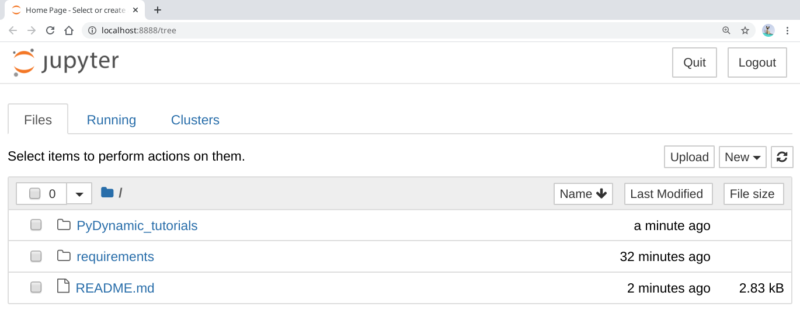

# _PyDynamic tutorials_

[](https://pydynamic-tutorials.readthedocs.io/en/latest/?badge=latest)

We prepared a collection of tutorials and examples to document, explain and illustrate
the possibilities offered by [_PyDynamic_](https://github.com/PTB-PSt1/PyDynamic). We
will add more and more examples over time, especially those that are currently
included in _PyDynamic_'s codebase subfolders
[examples](https://github.com/PTB-PSt1/PyDynamic/tree/master/examples) and
[tutorials](https://github.com/PTB-PSt1/PyDynamic/tree/master/tutorials).

## Getting started

To get going with the tutorials you can either start directly in your browser or get
a local copy and experiment offline on your machine.
 
 ### Quick start in current browser session
 
To start working in the notebooks directly in the browser, click [](https://mybinder.org/v2/gh/PTB-PSt1/PyDynamic_tutorials/master).
 
 ### Get a local copy to work offline

To get started on your local machine, follow these simple steps:

1. Clone the repository, if you haven't already
1. Set up a virtual environment for PyDynamic_tutorials
1. Install the dependencies
1. Start the Jupyter Notebook server
1. Go to localhost:8888 with your favourite browser
1. Browse the various examples in the repository, alter and execute the code right in
   your browser

#### 1. Clone the repository

```shell
$ git clone https://github.com/PTB-PSt1/PyDynamic_tutorials.git
Cloning into 'PyDynamic_tutorials'...
[...]
Receiving objects: 100% (3/3), done.
$
```

#### 2. Set up a virtual environment

On your command line/powershell execute:

```shell
$ python3 -m venv PyDynamic_tutorial_venv
$
```

This will create a subfolder _PyDynamic_tutorial_venv_ and prepare a fully
self-contained Python environment, which we can activate in the next step and install
further Python packages without polluting or disturbing your system environment.

#### 3. Install the dependencies

First we activate the previously created environment before we then install the required
dependencies in two steps, because we are utilizing `pip-tools` to ensure you get a
working copy of our environments.

```shell
$ source PyDynamic_tutorial_venv/bin/activate
(PyDynamic_tutorial_venv) $ pip install --upgrade pip pip-tools
Collecting pip
[...]
Successfully installed click-7.1.2 pip-20.1.1 pip-tools-5.2.0 setuptools-47.1.1 six-1.15.0
$ pip-sync requirements/requirement.txt
Collecting attrs==19.3.0
[...]
Installing collected packages: attrs, [...]
webencodings-0.5.1
$
```

#### 4. Start the notebook server

Now from the environment we created previously, start up the Jupyter Notebook server.

```shell
$ jupyter notebook
[I 13:01:24.790 NotebookApp] Serving notebooks from local directory: ~/code/PyDynamic_tutorials
[I 13:01:24.790 NotebookApp] The Jupyter Notebook is running at:
[I 13:01:24.790 NotebookApp] http://localhost:8888/?token=f368c552e042d48d46ff4c8a094448d0e7681790b0719215
```

#### 5. Go to localhost:8888

Usually a browser window will have opened automatically at this point. Otherwise just
open one yourself and navigate to the printed URL in the console, in our case
`http://localhost:8888/?token=f368c552e042d48d46ff4c8a094448d0e7681790b0719215`.

#### 6. Browse the various examples

You should see something like the following:



After a click on _PyDynamic_tutorials_ the source code can be edited and executed directly in the browser.

## PyDynamic

The [sourcecode of PyDynamic is available on GitHub](https://github.com/PTB-PSt1/PyDynamic).
The detailed documentation of _PyDynamic_'s source code is available on
[pydynamic.readthedocs.io](https://pydynamic.readthedocs.io/). The tutorial notebooks
are all linked on these pagKes along with additional material.